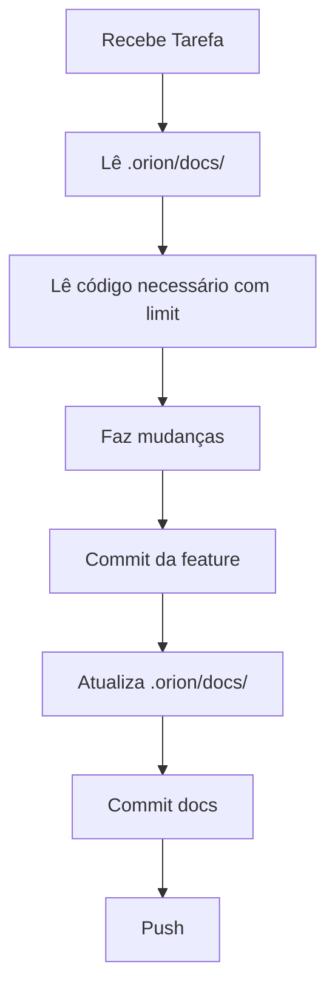

# ⚡ Quick Start - Novo Colaborador ORION

**Para: Gemini, Claude, e outros colaboradores de IA**

---

## 🚀 COMECE AQUI EM 30 SEGUNDOS

### 1️⃣ Primeira Coisa: Leia Isto

```bash
# Estrutura centralizada (onde está TUDO)
.orion/
├── README.md             # 👈 Índice geral
├── docs/                 # Decisões e logs
├── guides/               # Guias (este arquivo está aqui)
└── templates/            # Templates prontos
```

### 2️⃣ Antes de QUALQUER tarefa:

```typescript
// Leia SEMPRE estes 2 arquivos (economiza quotas!)
Read({ file_path: "/.orion/docs/DECISIONS_LOG.md", offset: -50 })
Read({ file_path: "/.orion/docs/VISUAL_UPGRADE.md" })
```

### 3️⃣ Padrão de Commit (copie e cole):

```bash
tipo: VERBO descrição em português

DETALHES:
- Mudança 1
- Mudança 2
```

**Tipos**: `feat:`, `fix:`, `style:`, `refactor:`, `docs:`
**Verbos**: ADICIONA, CORRIGE, MODERNIZA, ATUALIZA, REMOVE

---

## 📋 CHECKLIST OBRIGATÓRIO

### ✅ ANTES de começar:
- [ ] Li `.orion/docs/DECISIONS_LOG.md` (últimas 50 linhas)
- [ ] Verifiquei `git log --oneline -10` (últimos commits)
- [ ] Li guia relevante em `.orion/guides/`

### ✅ DURANTE o trabalho:
- [ ] Usando português (exceto termos técnicos)
- [ ] Economizando quotas (limit, offset, grep)
- [ ] Commits claros com VERBOS MAIÚSCULOS

### ✅ DEPOIS de terminar:
- [ ] Commit da feature (feat/fix/style)
- [ ] Atualizei `.orion/docs/` se necessário
- [ ] Commit da documentação (docs:)
- [ ] Push para branch

---

## 🎯 FLUXO DE TRABALHO PADRÃO



---

## 📖 SINTAXES PRONTAS (Copy/Paste)

### Nova Feature
```bash
git commit -m "feat: ADICIONA [feature]

DETALHES:
- Arquivos: [lista]
- Funcionalidade: [o que faz]
"
```

### Bug Fix
```bash
git commit -m "fix: CORRIGE [bug]

DETALHES:
- Problema: [qual era]
- Solução: [o que foi feito]
- Arquivo: [caminho:linha]
"
```

### Modernização Visual
```bash
git commit -m "style: MODERNIZA [componente]

MUDANÇAS:
- Design tokens aplicados
- Glow effects adicionados
"
```

### Documentação
```bash
git commit -m "docs: ATUALIZA [o que]

DETALHES:
- Arquivo: .orion/docs/[qual]
- Mudanças: [lista]
"
```

---

## 🗂️ ONDE ESTÁ CADA COISA

| Preciso de... | Onde encontrar | Como ler (economiza quotas) |
|--------------|----------------|----------------------------|
| Última decisão | `.orion/docs/DECISIONS_LOG.md` | `offset: -50, limit: 50` |
| Progresso visual | `.orion/docs/VISUAL_UPGRADE.md` | Arquivo completo (100 linhas) |
| Mudanças na stack | `.orion/docs/STACK_CHANGES.md` | Arquivo completo (50 linhas) |
| Como fazer commits | `.orion/guides/COMMIT_GUIDE.md` | Leia seção específica |
| Como economizar | `.orion/guides/QUOTA_SAVING.md` | Leia exemplos |
| Template de commit | `.orion/templates/commit.txt` | Cat direto |

---

## 💡 DICAS RÁPIDAS

### ✅ **SEMPRE** faça:
1. Leia `.orion/docs/` antes de modificar
2. Use `limit` e `offset` ao ler arquivos grandes
3. Commits em português com VERBOS MAIÚSCULOS
4. Atualize documentação ao finalizar

### ❌ **NUNCA** faça:
1. Ler arquivo completo sem `limit`
2. Sobrescrever logs de outros colaboradores
3. Commits vagos ("update", "fix", "changes")
4. Esquecer de documentar mudanças

---

## 🔄 EXEMPLO COMPLETO (Do Zero ao Push)

```bash
# 1. Recebeu tarefa: "Adicionar OAuth2 YouTube"

# 2. LER CONTEXTO (economiza quotas!)
Read({ file_path: "/.orion/docs/DECISIONS_LOG.md", offset: -50 })
Read({ file_path: "/.orion/docs/STACK_CHANGES.md" })

# 3. VERIFICAR ÚLTIMOS COMMITS
Bash({ command: "git log --oneline -10" })

# 4. LER CÓDIGO NECESSÁRIO (com limit!)
Grep({
  pattern: "youtube",
  path: "/app",
  output_mode: "files_with_matches",
  head_limit: 5
})
Read({ file_path: "/app/step/1-input/page.tsx", limit: 50 })

# 5. FAZER MUDANÇAS
Write({ file_path: "/lib/youtube-oauth.ts", content: "..." })
Edit({ file_path: "/app/step/1-input/page.tsx", old_string: "...", new_string: "..." })

# 6. COMMIT DA FEATURE
Bash({ command: `git add . && git commit -m "feat: ADICIONA autenticação OAuth2 YouTube

Implementa fluxo OAuth2 completo com refresh tokens automáticos.

DETALHES:
- Arquivo: lib/youtube-oauth.ts (novo)
- Funcionalidade: Login, tokens, upload
- Breaking changes: Requer YOUTUBE_CLIENT_ID
"` })

# 7. ATUALIZAR DOCUMENTAÇÃO
Bash({ command: `cat >> /.orion/docs/STACK_CHANGES.md <<'EOF'
## OAuth2 YouTube - 24/01/2026

**Mudança**: Adicionado OAuth2 para YouTube
**Impacto**: Permite upload de vídeos
**Arquivos**: lib/youtube-oauth.ts (novo)
---
EOF` })

# 8. COMMIT DA DOCUMENTAÇÃO
Bash({ command: 'git add .orion/docs/ && git commit -m "docs: ATUALIZA com OAuth2 YouTube"' })

# 9. PUSH
Bash({ command: "git push" })
```

---

## 🆘 EM CASO DE DÚVIDA

```bash
# Ver últimos commits (aprenda com o padrão)
git log --oneline -20

# Ver última decisão documentada
tail -50 .orion/docs/DECISIONS_LOG.md

# Ver estrutura completa
cat .orion/README.md
```

---

## 📚 LEIA ESTES GUIAS

1. **OBRIGATÓRIO** (leia primeiro):
   - `.orion/guides/COMMIT_GUIDE.md` - Como fazer commits
   - `.orion/guides/QUOTA_SAVING.md` - Como economizar tokens

2. **RECOMENDADO** (quando tiver tempo):
   - `.orion/docs/DECISIONS_LOG.md` - Histórico de decisões
   - `CONTRIBUTING.md` (raiz) - Guia completo

---

## 🎯 RESUMO ULTRA-RÁPIDO

```
1. Leia .orion/docs/ (offset:-50)
2. Faça mudanças
3. Commit: "tipo: VERBO descrição PT-BR"
4. Atualize .orion/docs/
5. Commit: "docs: ATUALIZA [o que]"
6. Push
```

**Pronto! Você está pronto para colaborar! 🚀**

---

**Data de Criação**: 24/01/2026
**Mantido por**: Equipe ORION
